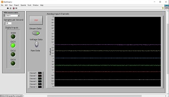

# Data Acquisition Module

## About
An exploration of Data Acquisition using Arduino based HW. In this case, the Atmega32u4 microcontroller.
This prototype consists of a custom USB connected board along with firmware and user interface software.

## The Project

Hardware design files are located at: [Hardware](/Hardware)
 
Arduino sketch firmware design files are located at: [Basic DAQ](/Software/Embedded/Arduino/DAQ%20Module/Basic%20DAQ)
 
Desktop Software design files are located at:  [BDAQ-6104 Instrument Driver](/Software/LabView/BDAQ-6104%20Instrument%20Driver)

